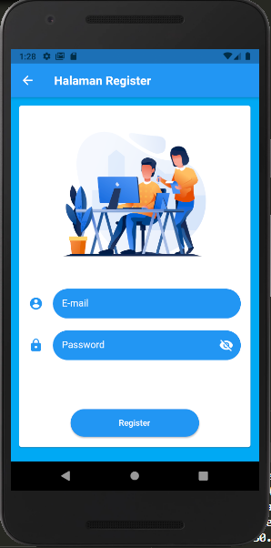

# PRAKTIKUM FIREBASE Minggu11

A new Flutter project.

## Getting Started

This project is a starting point for a Flutter application.
<li><b>Nama  : Riris Silvia Zahri
<li><b>Kelas : MI 2A
<li><b>NIM   : 1931710085

# Hasil Dari Praktikum
firebase authentification yang dapat digunakan untuk melakukan login dengan Akun Google.

# Hasil Dari tugas 
## Halaman Awal

## Modifikasi Halaman sign up dengan Akun google
user dapat login dengan menggunakan akun yang sudah terdaftarkan di google

## Halaman Registrasi user dengan email dan password

 ketika berhasil registrasi maka di web auth firebase akan terdapat user email dan password

## Halaman Login untuk menampilkan pesan erorr saat login dengan email dan password

## Halaman Login menggunakan user email dan passsword yang telah berhasil di registrasi

A few resources to get you started if this is your first Flutter project:

- [Lab: Write your first Flutter app](https://flutter.dev/docs/get-started/codelab)
- [Cookbook: Useful Flutter samples](https://flutter.dev/docs/cookbook)

For help getting started with Flutter, view our
[online documentation](https://flutter.dev/docs), which offers tutorials,
samples, guidance on mobile development, and a full API reference.
